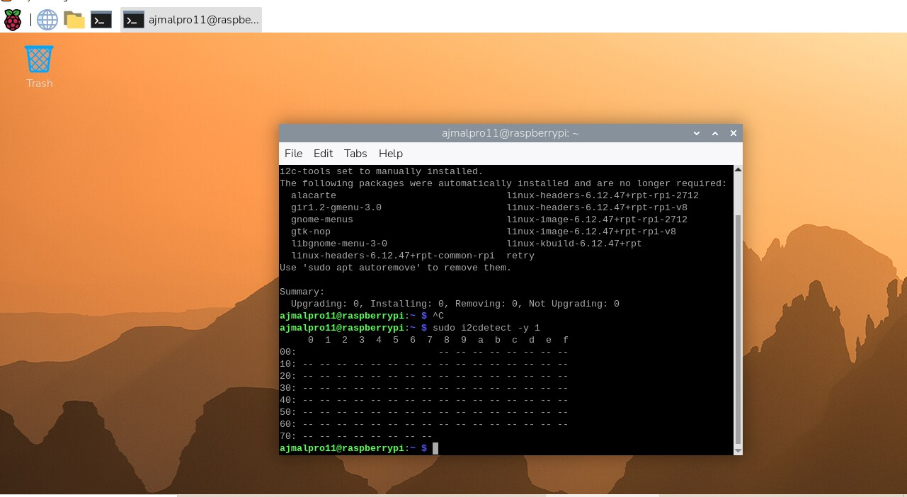
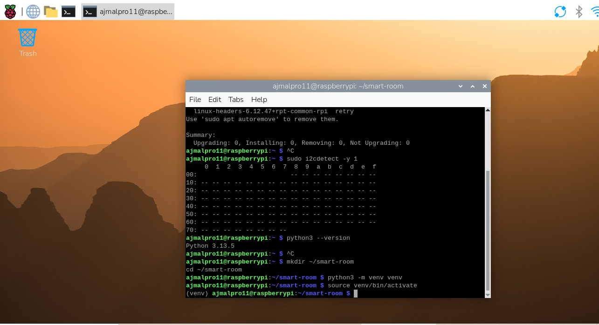
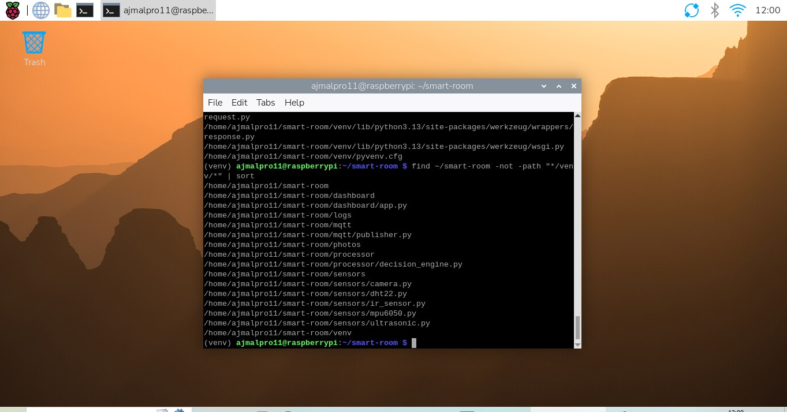
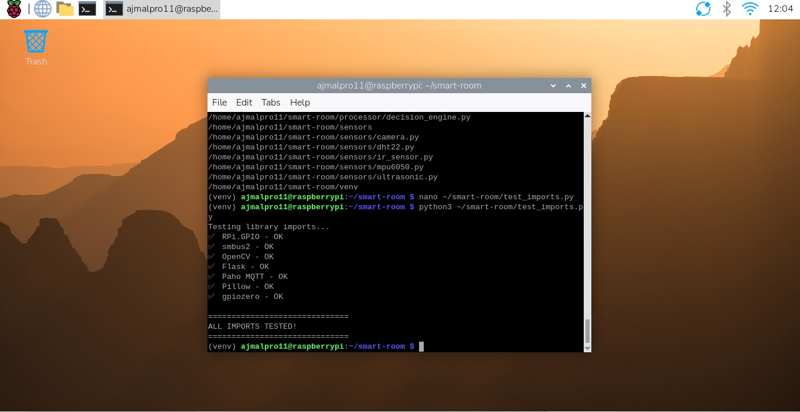

# 🏠 Smart Room Intelligence System

A multi-sensor edge IoT system built on Raspberry Pi 5 that detects 
intrusions, monitors environment, and serves a live web dashboard.
All processing happens locally — no cloud dependency.

## 🛠️ Built With
- Raspberry Pi 5
- Python 3.13
- MQTT (Mosquitto)
- InfluxDB + Grafana
- Flask
- OpenCV

## 📡 Sensors Used
- Ultrasonic (HC-SR04) — distance detection
- IR sensor — motion detection  
- DHT22 — temperature & humidity
- MPU-6050 — vibration detection
- Pi Camera — image capture

## 🚀 Setup & Installation

### 1. Clone the repository
```bash
git clone https://github.com/YOUR_USERNAME/smart-room.git
cd smart-room
```

### 2. Create virtual environment
```bash
python3 -m venv venv
source venv/bin/activate
```

### 3. Install dependencies
```bash
pip install -r requirements.txt
```

## 📸 Development Progress

### Environment Setup






## 📁 Project Structure
smart-room/
├── sensors/
│   ├── ultrasonic.py
│   ├── ir_sensor.py
│   ├── dht22.py
│   ├── mpu6050.py
│   └── camera.py
├── mqtt/
│   └── publisher.py
├── processor/
│   └── decision_engine.py
├── dashboard/
│   └── app.py
├── photos/
└── README.md
## 👨‍💻 Author
Ajumal Shamsudeen — TH Rosenheim
