# 🏠 Smart Room Intelligence System

> A fully local, edge-based IoT security and monitoring system built on Raspberry Pi 5.
> No cloud. No subscription. Just hardware, Python, and open source tools.


---

## 📌 Project Overview

This system combines multiple sensors to detect intrusions, monitor environment,
and serve a live web dashboard — all running locally on a Raspberry Pi 5.

When motion is detected and an object is within range:
- 📸 Camera captures a timestamped photo
- 🔊 Buzzer sounds an alert
- 📝 Event is logged with temperature and humidity
- 📊 All data streams to a live Grafana dashboard
- 🌐 Live camera feed visible from any device on WiFi

---

## 🛠️ Built With

| Tool | Purpose |
|---|---|
| Raspberry Pi 5 | Edge computing platform |
| Python 3.13 | Core programming language |
| gpiozero + lgpio | GPIO sensor control (Pi 5 compatible) |
| Picamera2 | Pi Camera Module 3 control |
| Mosquitto MQTT | IoT messaging broker |
| InfluxDB | Time-series data storage |
| Grafana | Live data visualization |
| Flask | Web dashboard framework |
| Docker Compose | Container orchestration |
| OpenCV | Image processing & camera stream |

---

## 📡 Sensors Used

| Sensor | GPIO Pins | Purpose |
|---|---|---|
| HC-SR04 Ultrasonic | TRIG:18 ECHO:24 | Distance detection |
| IR Obstacle Sensor | GPIO 23 | Motion detection |
| DHT22 | GPIO 17 | Temperature & humidity |
| MPU-6050 | I2C (SDA:GPIO2 SCL:GPIO3) | Vibration detection (pending) |
| Pi Camera Module 3 | CSI CAM0 | Image capture & live feed |
| Passive Buzzer | GPIO 25 | Audio alerts |

---

## 🗺️ System Architecture

```
HC-SR04 + IR + DHT22 + Camera + Buzzer
                 ↓
        Python Publisher (reads all sensors)
                 ↓
        MQTT Broker (Mosquitto :1883)
                 ↓
        ┌────────┴────────┐
        ↓                 ↓
   Subscriber         Flask App
        ↓             (app.py)
   InfluxDB               ↓
        ↓            Live Camera
   Grafana           + Sensor Status
   Dashboard         + Alert Log
   (:3000)           (:5000)
```

---

## 📸 Development Progress

### Phase 1 — Environment Setup

| Step | Screenshot |
|---|---|
| System updated | 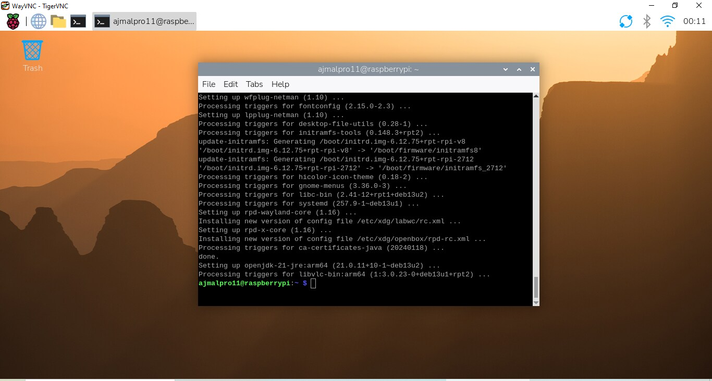 |
| I2C scan (empty) |  |
| Virtual environment |  |
| Project structure |  |
| All imports OK |  |
| First Git commit | 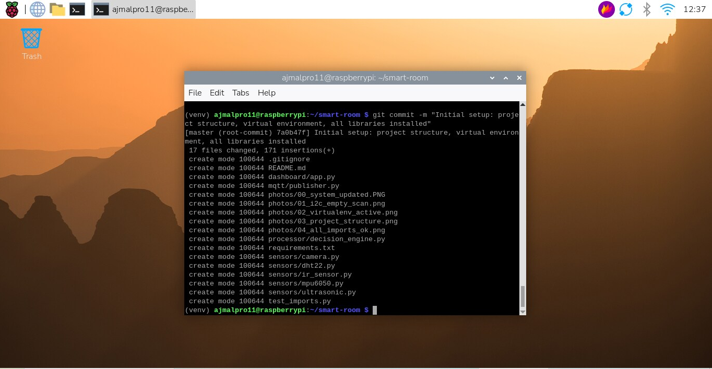 |
| GitHub live | 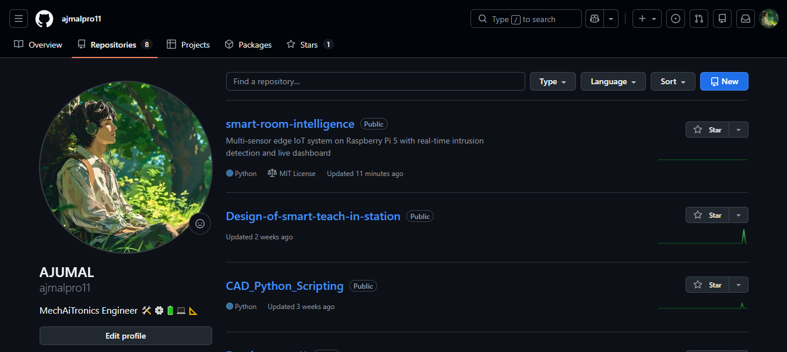 |

### Phase 1 — Sensor Setup

| Sensor | Wiring | Live Readings |
|---|---|---|
| Ultrasonic | 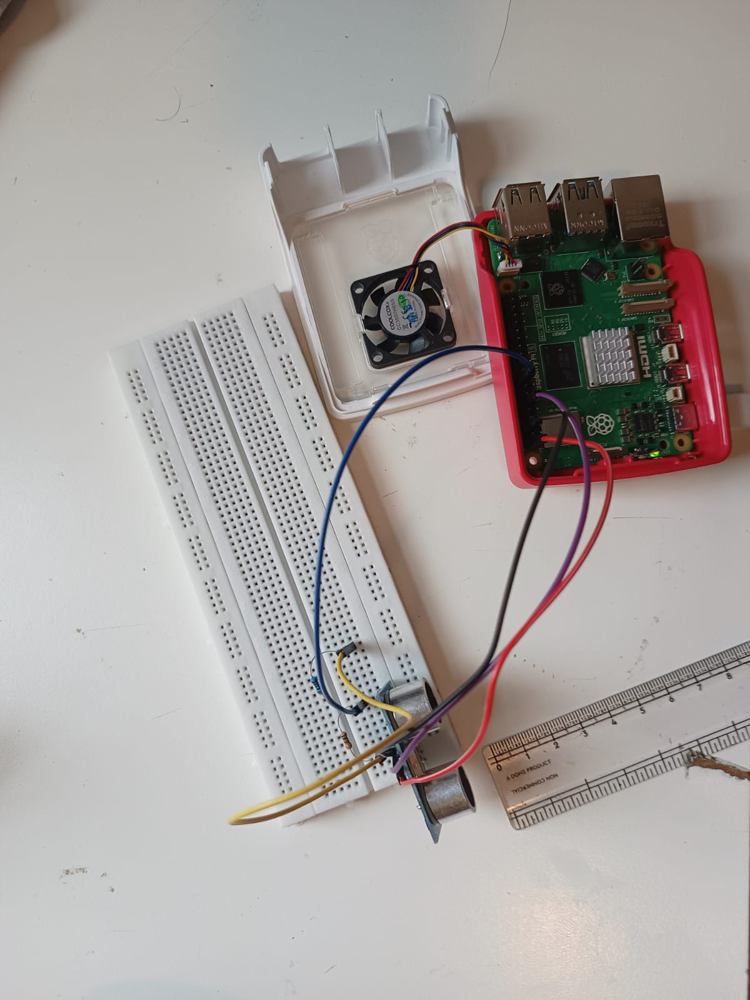 | 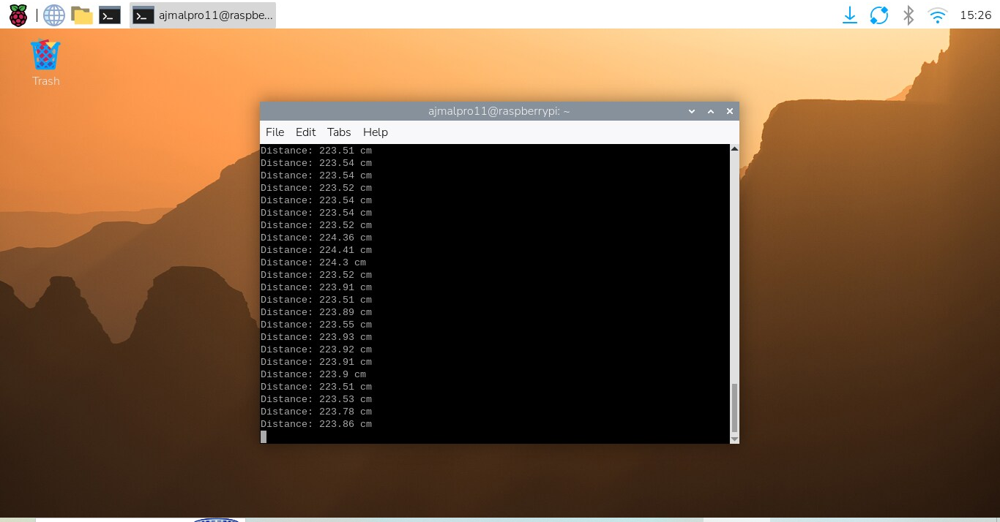 |
| IR Sensor | 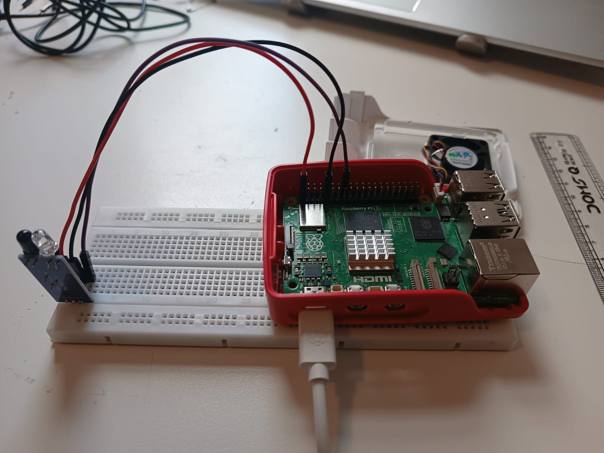 | 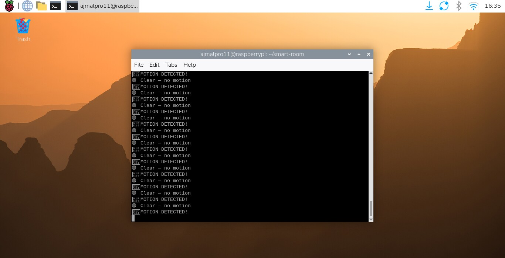 |
| Camera | — | 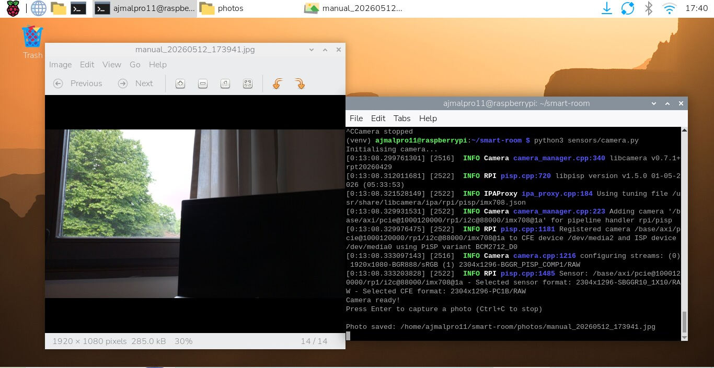 |
| DHT22 |  | 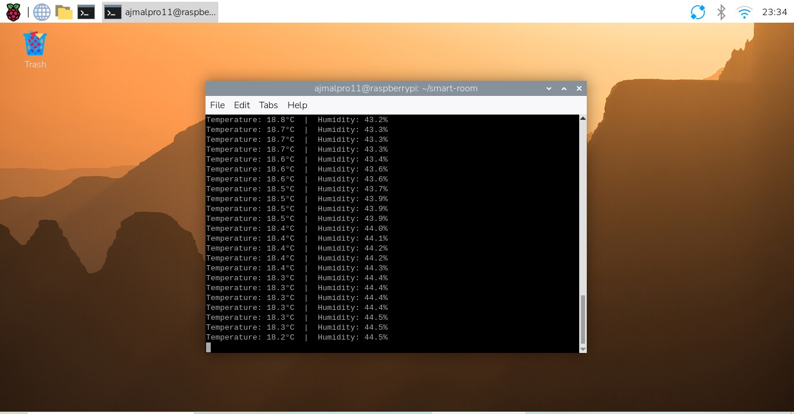 |
| Full wiring | 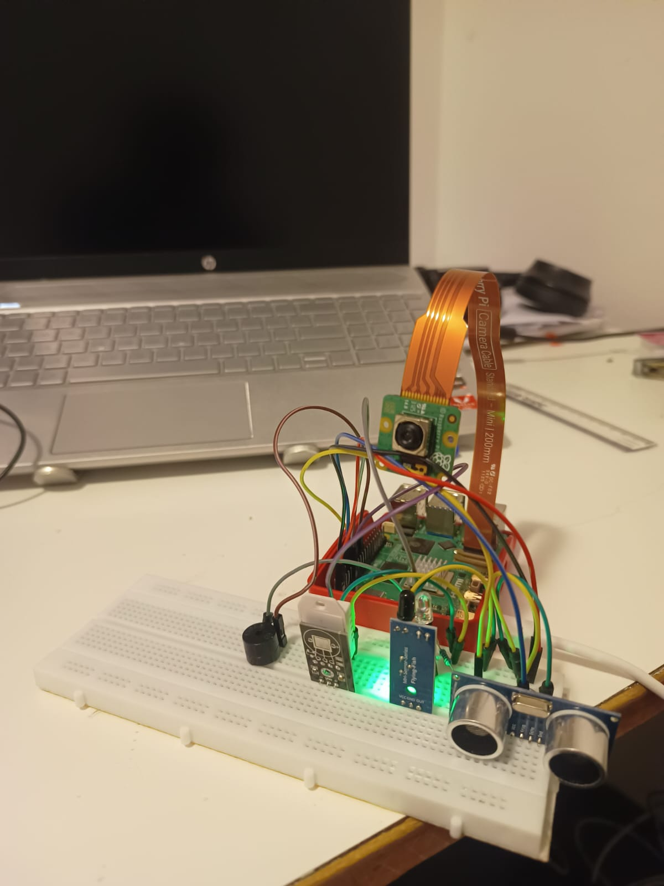 | — |

### Phase 2 — Decision Engine

| Screenshot | Description |
|---|---|
| 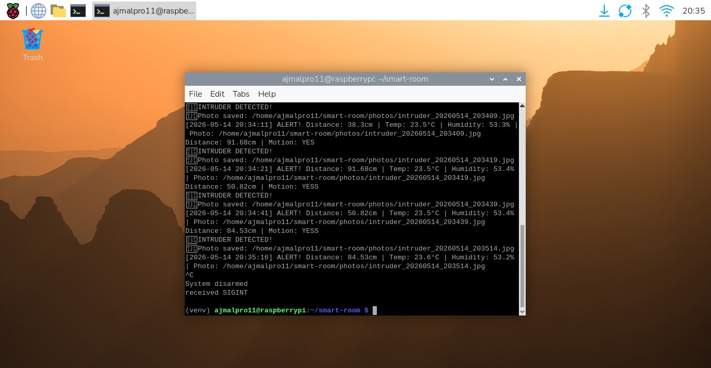 | Multi-sensor fusion triggering alerts |
|  | Auto-captured intruder photo |

### Phase 3 — IoT Pipeline

| Screenshot | Description |
|---|---|
| 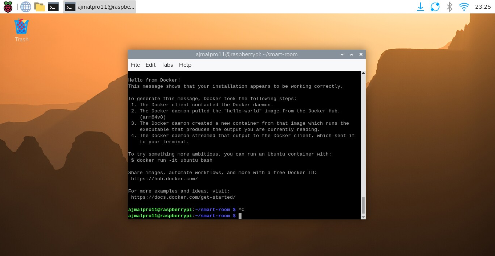 | Docker installed and running |
| 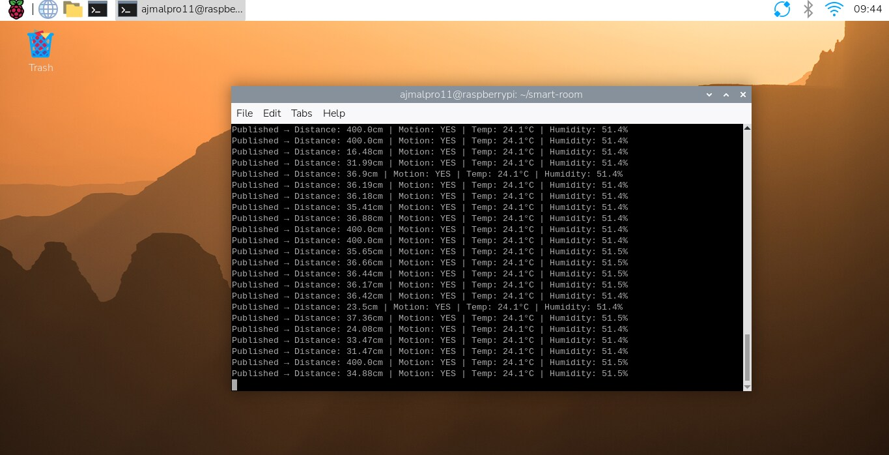 | MQTT publisher streaming sensor data |
| 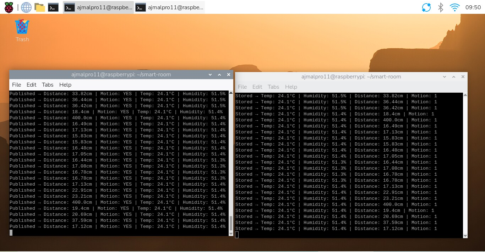 | Full pipeline — publisher and subscriber |
| 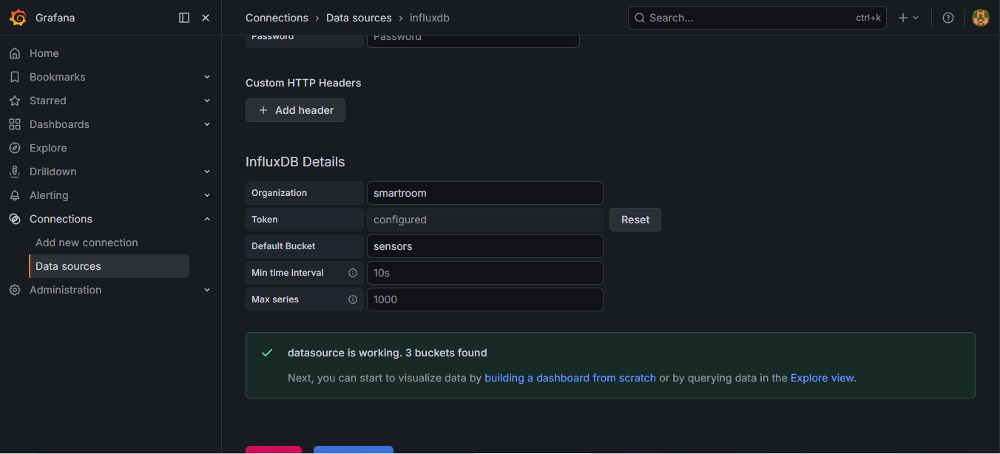 | InfluxDB connected to Grafana |
| 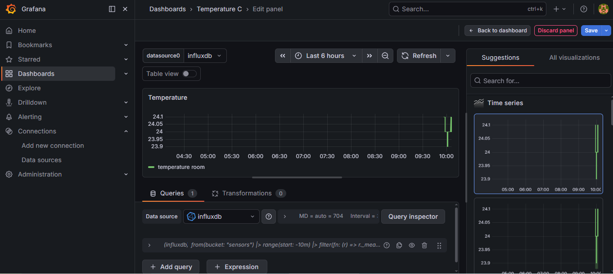 | Live temperature chart |
| 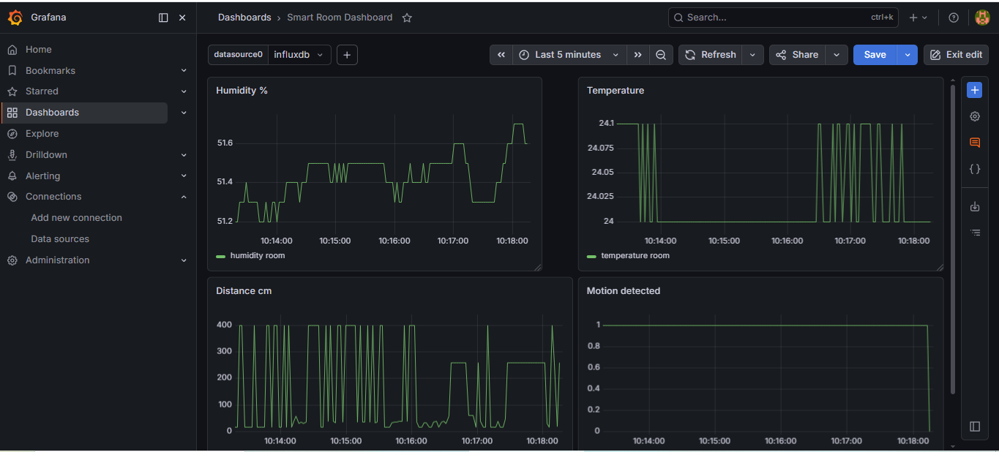 | Full 4-panel Grafana dashboard |

### Phase 4 — Web Dashboard

| Screenshot | Description |
|---|---|
| 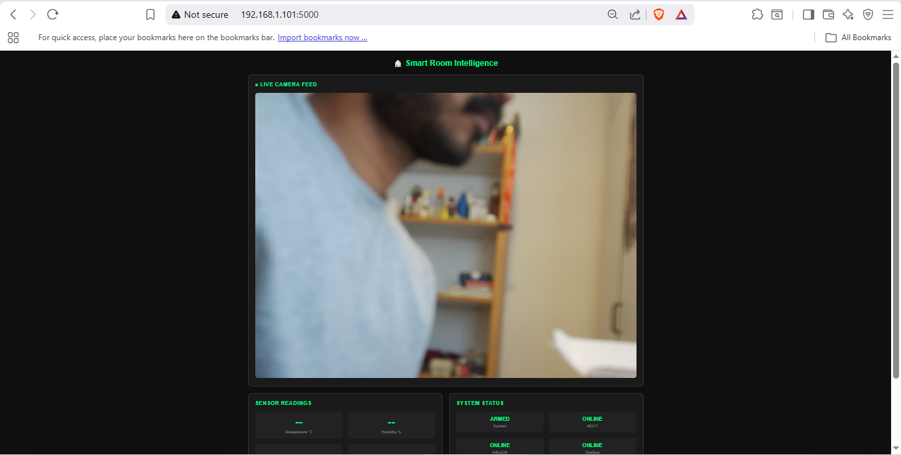 | Flask dashboard initial setup |
|  | Flask dashboard with live sensor readings |

---

## 🚀 Setup & Installation

### 1. Clone the repository
```bash
git clone https://github.com/ajmalpro11/smart-room-intelligence.git
cd smart-room-intelligence
```

### 2. Create virtual environment
```bash
python3 -m venv venv --system-site-packages
source venv/bin/activate
```

### 3. Install dependencies
```bash
pip install -r requirements.txt
```

### 4. Configure credentials
```bash
cp .env.example .env
nano .env
```

### 5. Start everything with one command
```bash
./start.sh
```

### 6. Stop everything
```bash
./stop.sh
```

**Access points:**
- 🌐 Flask Dashboard: `http://YOUR_PI_IP:5000`
- 📊 Grafana: `http://YOUR_PI_IP:3000`
- 🗄️ InfluxDB: `http://YOUR_PI_IP:8086`

---

## 📁 Project Structure

```
smart-room/
├── sensors/
│   ├── ultrasonic.py      ← HC-SR04 distance sensor
│   ├── ir_sensor.py       ← IR motion detection
│   ├── dht22.py           ← Temperature & humidity
│   ├── mpu6050.py         ← Vibration (pending soldering)
│   └── camera.py          ← Pi Camera Module 3
├── mqtt/
│   ├── publisher.py       ← Reads sensors, sends to MQTT
│   └── subscriber.py      ← Receives MQTT, stores in InfluxDB
├── processor/
│   └── decision_engine.py ← Multi-sensor fusion + alerts
├── dashboard/
│   ├── app.py             ← Flask web server
│   └── templates/
│       └── index.html     ← Web dashboard UI
├── mosquitto/config/      ← MQTT broker config
├── influxdb/              ← Time-series database
├── grafana/
│   └── dashboards/        ← Auto-provisioned Grafana dashboard
├── photos/                ← Development screenshots
├── logs/                  ← Alert logs
├── docker-compose.yml     ← Full stack orchestration
├── requirements.txt       ← Python dependencies
├── start.sh               ← One command to start everything
├── stop.sh                ← One command to stop everything
├── .env.example           ← Credential template
├── PROJECT_REPORT.md      ← Full technical report
└── README.md
```

---

## 📅 Project Phases

- [x] Phase 1 — Environment setup & sensor integration
- [x] Phase 2 — Multi-sensor decision engine
- [x] Phase 3 — MQTT + InfluxDB + Grafana pipeline
- [x] Phase 4 — Flask web dashboard with live camera
- [x] Phase 4 — Single command startup (start.sh / stop.sh)
- [x] Phase 4 — Grafana dashboard auto-provisioning
- [x] Phase 4 — Secure credentials via .env file
- [ ] Phase 5 — ML anomaly detection (coming soon)
- [ ] Phase 6 — MPU-6050 vibration sensor (pending soldering)

---

## 🔑 Credentials Setup

Copy the example env file and fill in your values:

```bash
cp .env.example .env
nano .env
```

> ⚠️ Never commit your `.env` file — it's already in `.gitignore`

---

## 📄 Technical Report

A full technical report covering hardware, software stack, implementation
details, challenges and results is available in
[PROJECT_REPORT.md](PROJECT_REPORT.md)

---

## 👨‍💻 Author

**Ajumal Shamsudeen** — TH Rosenheim, Germany

[](https://github.com/ajmalpro11)

---

## 📄 License

MIT License — feel free to use and modify!
